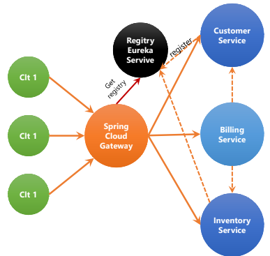
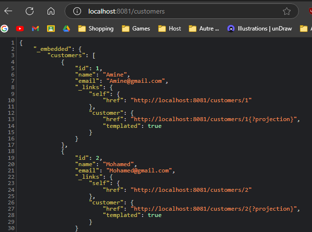
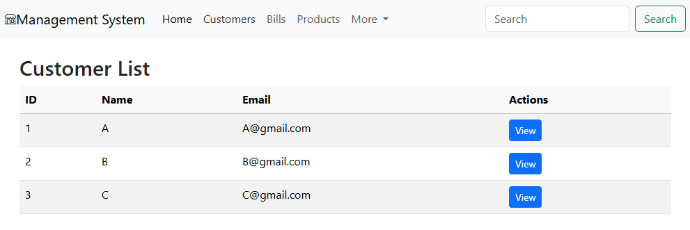
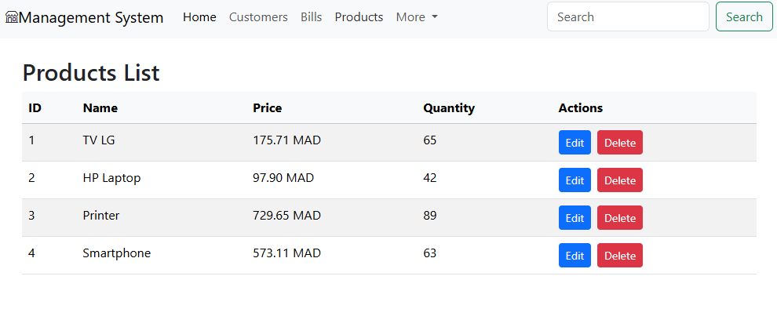
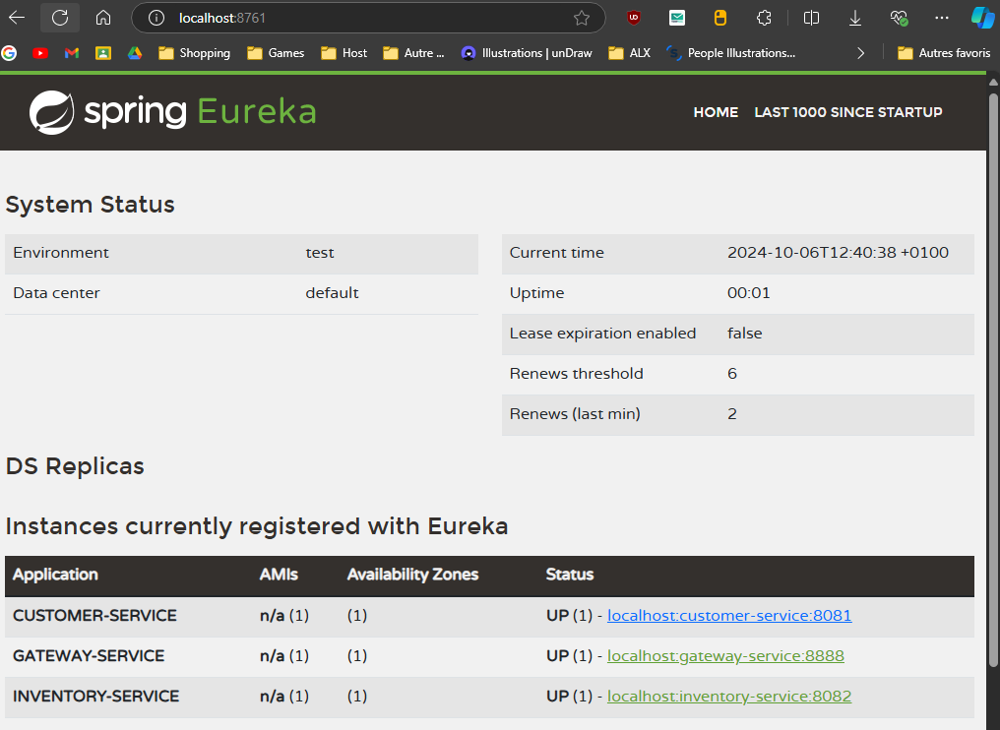

# DEMO Microservices-Based Billing Management System

This project demonstrates a microservices-based architecture built with **Spring Boot**, **Spring Cloud**, and **Spring Data JPA**. It manages customers, products, and billing services, and uses **Spring Cloud Gateway** for routing and **Eureka Discovery Server** for service registration and discovery.

## Architecture Overview

The system is based on a set of microservices that communicate with each other to manage customer data, product inventories, and bills. These microservices are registered with **Eureka Discovery Server** and accessed through **Spring Cloud Gateway**.



=======
## Project Structure

This project consists of the following services:

- **discovery-service**: Eureka Discovery Server
- **gateway**: Spring Cloud Gateway
- **customer-service**: Manages customer data
- **inventory-service**: Manages product inventory
- **billing-service**: Handles billing operations

```plaintext
.
├── billing-service (Java)
├── customer-service (Java)
├── discovery-service (Java)
├── inventory-service (Java)
├── gateway (Java)
└── frontend-service (Angular)
```

## Services

### 1. **Customer Service**

- This service is responsible for managing customer data. It provides endpoints to create, retrieve, update, and delete customers.
- **Port**: `8081`
Screenshot of Customer API Response:


Screenshot of Customer UI:


### 2. **Inventory Service**
- The Inventory Service handles all product-related operations. It provides endpoints to manage the inventory of products including creating, updating, and retrieving product information.
- **Port**: `8082`

Screenshot of Inventory API Response:


Screenshot of Product UI:


### 3. **Billing Service**

- The Billing Service manages billing operations, which include generating bills for customers based on the products they purchase. It integrates with the Customer Service and Inventory Service using **Feign Clients** for retrieving customer and product data.
- **Port**: `8083`
- **Technology**: Spring Boot, Feign Clients, Spring Data JPA

### 4. **Spring Cloud Gateway**

- The **Spring Cloud Gateway** acts as the unified entry point for client requests. It routes requests to the appropriate services (Customer, Inventory, Billing) based on the service discovery information from Eureka.
- **Port**: `8888`
- **Technology**: Spring Cloud Gateway

Example of a request through the gateway:
```bash
http://localhost:8888/CUSTOMER-SERVICE/customers
http://localhost:8888/INVENTORY-SERVICE/products
```

Screenshot of Gateway API:


### 5. **Eureka Discovery Server**

- The **Eureka Discovery Server** registers all the services, making it easier for them to discover and communicate with each other.
- **Port**: `8761`
- **Technology**: Spring Cloud Eureka

Screenshot of Eureka Dashboard:


<<<<<<< HEAD
## Project Structure

This project consists of the following services:

- **discovery-service**: Eureka Discovery Server
- **gateway**: Spring Cloud Gateway
- **customer-service**: Manages customer data
- **inventory-service**: Manages product inventory
- **billing-service**: Handles billing operations

## Dependencies

Here is a list of key dependencies used in each service:

### Common Dependencies
- **Spring Boot** (v3.3.4)
- **Spring Data JPA**
- **H2 Database** (In-memory database for development)
- **Lombok** (for reducing boilerplate code)
- **Spring Boot DevTools** (for live reload during development)

### Customer, Inventory, and Billing Services
- **Spring Boot Starter Web**: For building web and RESTful services.
- **Spring Data REST**: For easy exposure of repositories as RESTful endpoints.
- **Spring Data JPA**: For data persistence and interaction with the H2 database.

### Billing Service Specific
- **OpenFeign**: Declarative REST client used for inter-service communication.
- **Feign Clients**: To communicate with Customer and Inventory services.

### Gateway Service
- **Spring Cloud Gateway**: For routing requests to the relevant microservices.

### Discovery Service
- **Spring Cloud Netflix Eureka**: For service discovery and registration.

### Other Dependencies
- **Spring Boot Actuator**: Provides endpoints to monitor and manage your application.
- **Spring HATEOAS**: To include hypermedia links in the response data.

## How to Run the Project

To run any service use 

```sh
mvn clean install
mvn spring-boot:run
```

1. **Start the Eureka Discovery Service**:  
   Run the `discovery-service`.
   

3. **Start the Gateway Service**:  
   Run the `gateway` service.

4. **Start the Customer, Inventory, and Billing Services**:  
   Run `customer-service`, `inventory-service`, and `billing-service`.

5. **Access Services via Gateway**:
  - Customer Service: `http://localhost:8888/CUSTOMER-SERVICE/customers`
  - Inventory Service: `http://localhost:8888/INVENTORY-SERVICE/products`
  - Billing Service: `http://localhost:8888/BILLING-SERVICE/bills`

5. **Access Eureka Dashboard**:  
   - Eureka dashboard will be available at `http://localhost:8761/`
   - Eureka dashboard will be available at `http://localhost:8761/`
